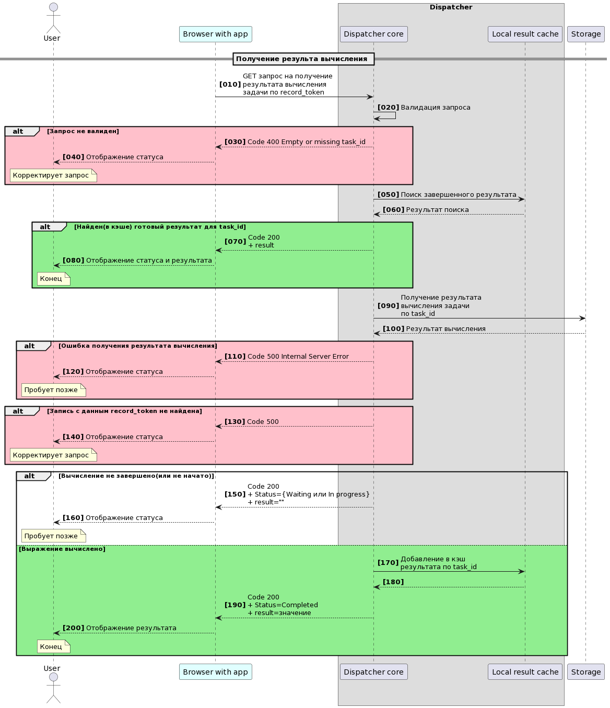

# Рапределенный вычислитель


## Содержание
- [Общее описание решения](#solution-discriber)
- [Диспетчер](#dispatcher)
    - [Настройки Диспетчера](#dispatcher-settings)
    - [Запуск Диспетчера](#dispatcher-start)
    - [Запросы на вычисление выражений](#dispatcher-query-post)
    - [Запросы информации о ходе и результатах вычислений](#dispatcher-query-get)
- [Хранилище](#storage)
- [Менеджер](#manager)
- [Frontend](#frontend)
- [Todo](#todo)

<a name="solution-discriber"><h2>Общее описание решения</h2></a>
Распределенный вычислитель представляет собой несколько независимых взаимодействующих сервисых компонент:
- Диспетчер - выполняет приём от клиентов запросов на вычисления, регистрацию заданий на вычисления в Хранилище, а также предоставляет клиентам информацию о ходе и результатах вычислений 
- Хранилище - промежуточное звено между Диспетчером и Менеджером, предназначенное для регистрации выражений на вычисления, хранения и обработки заданий на вычисление выражений
- Менеджер - выполняет функции оркестрации заданий на вычисления выражений; запускает и управляет вычислениями посредством специальных обработчиков-вычислителей

Для взамодействия с вычислителем, в качестве клиентского приложения,  предлагается используется специальную HTML страницу(см. [Frontend](#frontend)), однако вы вольны использовать любой другой инструмент(Curl, Postman и т.п.).


<a name="dispatcher"><h2>Диспетчер</h2></a>
Приём входящих клиентских запросов реализован через специально созданный интерфейс HTTP API.
- Для приёма клиентских запросов на вычисления выражений(с последующей их регистрацией в Хранилище), используются [Запросы на вычисление выражений](#dispatcher-query-post).
- Для приёма клиентских запросов информации о ходе и результатах вычислений, используются [Запросы информации о ходе и результатах вычислений](#dispatcher-query-get).


Дополнительные замечания:
- Обработка обоих видов запросов реализована в рамках одного сервиса, но для обработки каждого вида(запросов) используется отдельный набор горутин. 
- Диспетчер использует только одно соединение с Хранилищем, которое инициализируется при старте(Диспетчера). 
- Диспетчер сохраняет работоспособность, независимо от Хранилища и Менеджера. 


<a name="dispatcher-settings"><h3>Настройки Диспетчера</h3></a>
Пакет Диспетчер расположен в  /cmd/dispatcher/main.go

Настройки параметров работы Диспетчера представлены в файле "dispatcherConfig.json".
- expressionEndpoint - т.н. endpoint, т.е. адрес ресурса, через который построено взаимодействие с Диспетчером
- serverAddress - адрес и порт, на котором работает сервис
- useLocalExpressionCache - флаг использования локального кэша выражений. Если значение настройки - true, тогда перед регистрацией выражения в Хранилище, программа будет проверять наличие данного выражения и соответствующего идентификатора задания на вычисление в специальном локальном кэше. Кроме того, после регистрации задания в хранилище, в локальный кэш будет добавлена запись о данном выражении и соответствующем идентификаторе задания на вычисление 
- usePrepareValidation - флаг выполнения вализации входящих выражений. Если значение настройки - true, тогда выражения будут проходить предварительную валидацию(см. настройку prepareValidationRegex)
- prepareValidationRegex - строка регулярного выражения, используемая при валидации входящих выражений(см. usePrepareValidation). Настройка используется только если usePrepareValidation=true
- searchingBeforeAddToDB - флаг выполнения поиска выражения в Хранилище перед его регистрацией. Если значение настройки - true, тогда перед регистрацией выражения в Хранилище, программа выполнит поиск выражения в Хранилище, и если найдет, то вернет соответствующий идентификатор задачи на вычисление(если записей будет несколько, то будет возвращен идентификатор самой новой).
- useLocalResultCache - флаг использования локального кэша результатов. Если значение настройки - true, тогда перед соответствующим обращением к Хранилищу, будет произведен поиск результата вычисления по идентификатору вычислительного задания в специальном кэше результатов. Если результат вычисления будет найден в этом кэше, то обращения к Хранилищу выполняться не будет, клиенту будет возвращен результат из кэша. Если в кэше не будет найдена запись результата, то программа выполнит запрос к Хранилищу и вернет соответствующий результат клиенту. При этом, если окажется, что вычисление уже завершилось, то в локальный кэш результатов будет добавлена соответствующая запись для данного вычислительного задания.
- dbConnectionConfig - параметры соединения с Хранилищем(в данной реализации с базой данных)

Пример настроечного файла:
```json
{
    "expressionEndpoint": "/expression",
    "serverAddress": "127.0.0.1:8081",
    "useLocalExpressionCache": true,
    "searchingBeforeAddToDB": true,
    "useLocalResultCache": true,
    "dbConnectionConfig": {
        "host": "127.0.0.1",
        "port": 5432,
        "user": "root",
        "password": "root",
        "dbname": "postgres"
    }
}
```

<a name="dispatcher-start"><h3>Запуск Диспетчера</h3></a>

<!-- описание запуска -->

<a name="dispatcher-query-post"><h3>Запросы на вычисление выражений</h3></a>

Диаграмма последовательности обработки запросов данного вида:


Обработка включает несколько последовательных этапов:
- первичная валидация выражения(опциональная проверка на допустимые символы, без вычисления выражения и т.п.)
- регистрация выражения в Хранилище "как есть", т.е. в той форме(строкового представления), в каком оно было передано Диспетчеру
- возврат клиенту идентификатора("task_id") задания на вычисление выражения


Запрос постановки на вычисление выражения должен представлять собой POST запрос вида:
```
curl -X POST -H "Content-Type: application/json" -d '{"expression": "value_expression"}' http://server-address/endpoint
```
Здесь арифметическое выражение необходимо передавать в теле запроса в качестве значения атрибута "expression".

Пример запроса и ответа:
```
curl -X POST -H "Content-Type: application/json" -d '{"expression": "1+6"}' http://localhost:8081/expression
```
```
{"task_id":"8"}
```


<a name="dispatcher-query-post"><h3>Запросы информации о ходе и результатах вычислений</h3></a>
Диаграмма последовательности обработки запросов данного вида:


Обработка включает несколько последовательных этапов:
- поиск результата в локальном кэше результатов вычислений(опционально, см. настройку useLocalResultCache)
- поиск результата в Хранилище
- обогащение локального кэша результатов для завершенных вычислений(опционально, см. настройку useLocalResultCache)
- возврат клиенту информации о ходе вычисления, или результата(если вычисление завершено)


Запрос информации о ходе вычислений должен представлять собой GET запрос вида:
```
curl "http://server_address/endpoint?task_id=your_task_id"
```

- task_id - идентификатор вычислительной задачи, который был присвоен выражению при его регистрации в Хранилище методом POST
- status - состояние вычисления("Waiting" - ожидает вычисления; "In progress" - в процессе вычисления; "Completed" - выычисление завершено) 
- result - результат вычисления. Атрибут возвращается заполненным только если вычисления выражения завершено(т.е. если status = "Completed"). Если вычисление не завершено, то атрибут будет без значения.
Атрибуты status и result возвращаются только при успешном выполнении запроса.

Пример запроса и ответа:
```
~$ curl "http://localhost:8081/expression?task_id=4"
```
```
{"result":"3","status":"Completed"}
```

<a name="storage"><h2>Хранилище</h2></a>

<!-- описание работы с Хранилищем -->

<a name="manager"><h2>Менеджер</h2></a>

<!-- описание работы с Менеджером -->

<a name="frontend"><h2>Frontend</h2></a>
В качестве клиентского приложения предлагается воспользоваться файлом: /fronend/calc_front.html

Максимальная длина выражения - 255 символов

<!-- описание работы с приложением -->

<a name="todo"><h2>Todo</h2></a>

<!-- описание возможных улучшений-->