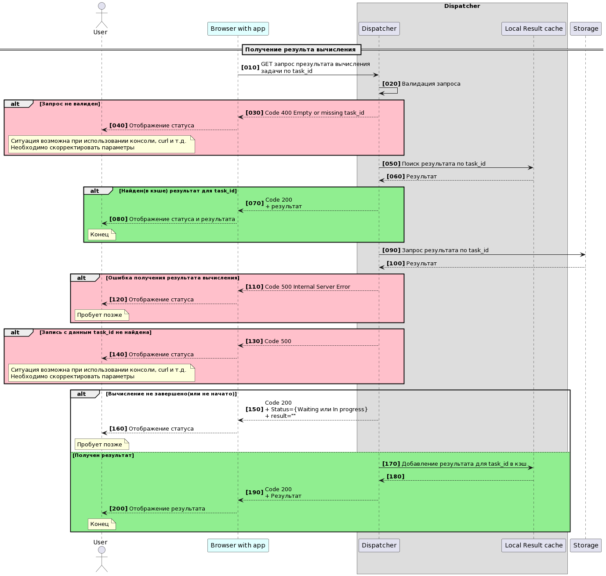

# Рапределенный вычислитель


## Содержание
- [Общее описание решения](#solution-discriber)
- [Диспетчер](#dispatcher)
    - [Настройки Диспетчера](#dispatcher-settings)
    - [Запуск Диспетчера](#dispatcher-start)
    - [Запросы на вычисление выражений](#dispatcher-query-post)
    - [Запросы информации о ходе и результатах вычислений](#dispatcher-query-get)
- [Хранилище](#storage)
     - [Настройка Хранилища](#storage-start)
- [Менеджер](#manager)
    - [Настройки Менеджера](#manager-settings)
    - [Запуск Менеджера](#manager-start)
    - [Взаимодействие с Демоном(вычислителем)](#manager-daemon)
    - [Взаимодействие с Frontend](#manager-frontend)
- [Демон](#daemon) 
    - [Настройки Демона](#daemon-settings)
    - [Вычисление выражений](#daemon-calc)
    - [Запуск Демона](#daemon-start)
    - [Взаимодействие с Менеджером](#daemon-manager)
    - [Взаимодействие с Frontend](#daemon-frontend)
- [Frontend](#frontend)

- [Подготовка и запуск проекта](#prepare_and_start)

- [Todo](#todo)

<a name="solution-discriber"><h2>Общее описание решения</h2></a>

### Исходная задача
- [Скриншот задания №1](docs/the_formulation_of_the_task/zadacha_screen1.jpg)
- [Скриншот задания №1](docs/the_formulation_of_the_task/zadacha_screen2.jpg)
- [Перечень требований №1](docs/the_formulation_of_the_task/requirements1.txt)
- [Перечень требований №2](docs/the_formulation_of_the_task/requirements2.txt)


##

Распределенный вычислитель представляет собой несколько независимых взаимодействующих сервисых компонент:
- Диспетчер - выполняет приём от клиентов запросов на вычисления, регистрацию заданий на вычисления, а также предоставляет клиентам информацию о результатах вычислений. Регистрация заданий на вычисления, а также получение информации о результатах расчетов производятся посредством выполнения запросов к Хранилищу. 
- Хранилище - промежуточное звено между Диспетчером и Менеджером, предназначенное для регистрации выражений на вычисления, хранения и обработки заданий на вычисление выражений.
- Менеджер - выполняет функции оркестрации заданий на вычисления выражений, посредством запросов взаимодействует с Демоном(вычислителем), управляет результатами вычислений.
- Демон(вычислитель) - получает задания на вычисления от Менеджера, выполняет вычисление арифметических выражений и возвращает результаты(Менеджеру)

Для взамодействия с вычислителем, в качестве клиентского приложения,  предлагается используется специальную HTML страницу(см. [Frontend](#frontend)), однако вы вольны использовать любой другой инструмент(Curl, Postman и т.п.).


- [Целевая архитектура](docs/images/ggoals.jpg)

<a name="dispatcher"><h2>Диспетчер</h2></a>
Диспетчер обеспечивает приём от клиентов запросов на вычисления, регистрацию заданий на вычисления, а также предоставляет клиентам информацию о результатах вычислений. Регистрация заданий на вычисления, а также получение информации о результатах расчетов производятся посредством выполнения запросов к Хранилищу.

Приём входящих клиентских запросов реализован через специально созданный интерфейс HTTP API.
- Для приёма клиентских запросов на вычисления выражений(с последующей их регистрацией в Хранилище), используются [Запросы на вычисление выражений](#dispatcher-query-post).
- При приёме клиентских запросов на вычисления выражений, применяется контроль идемпотентности по идентификаторам входящих запросов
- Для приёма клиентских запросов информации о ходе и результатах вычислений, используются [Запросы информации о ходе и результатах вычислений](#dispatcher-query-get)
- При обработке входящих запросов обоих видов может быть использовано кэширование


Дополнительные замечания:
- Обработка обоих видов запросов реализована в рамках одного потока главной программы. 
- Диспетчер взаимодействует с Хранилищем(СУБД PostgeSQL) посредством библиотеки "github.com/lib/pq"   
- Диспетчер использует только одно соединение с Хранилищем, которое инициализируется при старте(Диспетчера). Поэтому, перед запуском Диспетчера, необходимо обеспечить доступность Хранилища. Далее, в ходе работы Диспетчера, Хранилище можно выключать и включать(при включенном и доступном Хранилище, Диспетчер сможет с ним взаимодействовать).
- Диспетчер сохраняет работоспособность, независимо от Хранилища и других компонент.  


<a name="dispatcher-settings"><h3>Настройки Диспетчера</h3></a>
Пакет Диспетчер расположен в:  /cmd/dispatcher/main.go

Настройки параметров работы Диспетчера представлены в файле /cmd/dispatcher/dispatcher_config.json

- dispatcherEndpoint - endpoint, т.е. адрес ресурса, через который построено взаимодействие с Диспетчером
- serverAddress - адрес и порт, на котором работает сервис
- maxLenghtRequestId - максимальная длина идентификатора запроса на регистрацию(вычисление) нового выражения 
- usePrepareValidation - флаг выполнения вализации входящих выражений. Если значение настройки - true, тогда выражения будут проходить предварительную валидацию(см. настройку prepareValidationRegex)
- prepareValidationRegex - строка регулярного выражения, используемая при валидации входящих выражений(см. usePrepareValidation). Настройка используется только если usePrepareValidation=true
- maxLenghtExpression - значение максимальной длины выражения(не может быть более 255)
- useLocalRequestIdCache - флаг использования локального кэша идентификаторов зарегистрированных на вычисления выражений. Используется при кэшировании запросов на добавление заданий на вычисление выражений. Если значение настройки - true, тогда перед обращением к Хранилищу, программа будет искать идентификатор соответствующей задачи в кэше. Если идентификатор задания будет найден в этом кэше, то обращения к Хранилищу выполняться не будет, клиенту будет возвращен результат из кэша. Если в кэше не будет найдена запись идентификатора, то программа выполнит запрос к Хранилищу и вернет соответствующий результат клиенту. При этом, если окажется, что задание ещё не зарегистрировано, то в локальный кэш будет добавлена соответствующая запись идентификатора для данного идентификатора запроса.
- useLocalResultCache - флаг использования локального кэша результатов вычислений. Если значение настройки - true, тогда перед соответствующим обращением к Хранилищу, будет произведен поиск результата вычисления по идентификатору вычислительного задания в специальном кэше результатов. Если результат вычисления будет найден в этом кэше, то обращения к Хранилищу выполняться не будет, клиенту будет возвращен результат из кэша. Если в кэше не будет найдена запись результата, то программа выполнит запрос к Хранилищу и вернет соответствующий результат клиенту. При этом, если окажется, что вычисление уже завершилось, то в локальный кэш результатов будет добавлена соответствующая запись для данного вычислительного задания.
- dbConnectionConfig - стандартные параметры соединения с Хранилищем(в данной реализации с базой данных)

Пример настроечного файла:
```json
{
    "dispatcherEndpoint": "/expression",
    "serverAddress": "127.0.0.1:8081",
    "maxLenghtRequestId": 50,
    "usePrepareValidation": true,
    "prepareValidationRegex": "^[0-9+\\-*/().^\\s]+$",
    "maxLenghtExpression": 255,
    "useLocalRequestIdCache": true,
    "useLocalResultCache": true,
    "dbConnectionConfig": {
        "host": "127.0.0.1",
        "port": 5432,
        "user": "root",
        "password": "root",
        "dbname": "calcDB"
    }
}
```

<a name="dispatcher-start"><h3>Запуск Диспетчера</h3></a>

```
go run cmd/dispatcher/main.go

```


<a name="dispatcher-query-post"><h3>Запросы на вычисление выражений</h3></a>


Обработка включает несколько последовательных этапов:
- проверка наличия идентификатора запроса в заголовке
- поиск в локальном кэше идентификатора задания ("task_id") по идентификатору запроса(опционально, см. настройку useLocalRequestIdCache)
- первичная валидация выражения(опциональная проверка на допустимые символы, без вычисления выражения и т.п.)
- регистрация выражения в Хранилище "как есть", т.е. в той форме(строкового представления), в каком оно было передано Диспетчеру
- обогащение локального кэша результатов для завершенных вычислений(опционально, см. настройку useLocalRequestIdCache)
- возврат клиенту идентификатора("task_id") задания на вычисление выражения

Запрос постановки на вычисление выражения должен представлять собой POST запрос вида:
```
curl -X POST -H "Content-Type: application/json" -H "X-Request-ID: ваш_идентификатор_запроса" -d '{"expression": "ваше_выражение"}' http://адрес_диспетчера:порт_диспетчера/endpoint_диспетчера

```

Пример запроса и ответа:
```
curl -X POST -H "Content-Type: application/json" -H "X-Request-ID: lsphju9uygwhrjv6ywr" -d '{"expression": "2+2"}' http://localhost:8080/expression

```
```
{"task_id":"8"}
```


<a name="dispatcher-query-post"><h3>Запросы информации о результатах вычислений</h3></a>



Обработка включает несколько последовательных этапов:
- поиск результата по идентификатору задания("task_id") в локальном кэше результатов вычислений(опционально, см. настройку useLocalResultCache)
- поиск результата идентификатору задания("task_id") в Хранилище
- обогащение локального кэша результатов для завершенных вычислений(опционально, см. настройку useLocalResultCache)
- возврат клиенту информации о ходе вычисления, или результата(если вычисление завершено)

Запрос информации о результате вычисления должен представлять собой GET запрос вида:
```
curl http://адрес_диспетчера:порт_диспетчера/endpoint_диспетчера?task_id=task_id
```

- task_id - идентификатор вычислительной задачи, который был присвоен выражению при его регистрации в Хранилище методом POST
- status - состояние вычисления("Waiting" - ожидает вычисления; "In progress" - в процессе вычисления; "Completed" - выычисление завершено) 
- result - результат вычисления. Атрибут возвращается заполненным только если вычисления выражения завершено(т.е. если status = "Completed"). Если вычисление не завершено, то атрибут будет без значения.
Атрибуты status и result возвращаются только при успешном выполнении запроса.

Пример запроса и ответа:
```
~$ curl "http://localhost:8081/expression?task_id=129"
```
```
{
    "expression": "10+2.5+15+15/3",
    "result": "0",
    "status": "error",
    "is_finished": true,
    "is_wrong": true,
    "calc_duration": 21814,
    "comment": "The allowed calculation timeout has been exceeded"
}
```

<a name="storage"><h2>Хранилище</h2></a>
Хранилище предназначено для регистрации выражений на вычисления, хранения и обработки заданий на вычисление выражений. 

Хранилище реализовано на базе СУБД PostgeSQL и состоит из двух таблиц, которые описываются своими скриптами создания:

1. reg_expr - основная таблица регистрации заданий на вычисления

```
-- Generated by the database client.
CREATE TABLE reg_expr(
    id SERIAL NOT NULL,
    request_id varchar(50) NOT NULL,
    reg_date timestamp without time zone NOT NULL,
    expression varchar(255) NOT NULL,
    result double precision DEFAULT 0.00,
    status varchar(50) NOT NULL DEFAULT 'new'::character varying,
    is_finished boolean NOT NULL DEFAULT false,
    finish_date timestamp without time zone,
    is_wrong boolean DEFAULT false,
    calc_duration integer NOT NULL DEFAULT 0,
    comment varchar(255),
    PRIMARY KEY(id)
);
CREATE INDEX idx_reg_expr_request_id ON reg_expr USING hash ("request_id");
CREATE INDEX idx_reg_expr_reg_date ON reg_expr USING btree ("reg_date");
COMMENT ON COLUMN reg_expr.request_id IS 'Идентификатор запроса на вычисление выражения';
COMMENT ON COLUMN reg_expr.reg_date IS 'Дата и время регистрации выражения на вычисление';
COMMENT ON COLUMN reg_expr.expression IS 'Выражение для вычисления';
COMMENT ON COLUMN reg_expr.result IS 'Результат вычисления выражения';
COMMENT ON COLUMN reg_expr.status IS 'Краткое описание: new, success, cancel, error';
COMMENT ON COLUMN reg_expr.is_finished IS 'Статус завершения вычисления выражения';
COMMENT ON COLUMN reg_expr.finish_date IS 'Дата и время завершения обработки вычисления';
COMMENT ON COLUMN reg_expr.is_wrong IS 'Флаг ошибки';
COMMENT ON COLUMN reg_expr.calc_duration IS 'Время обработки на вычислителе(в секундах)';
COMMENT ON COLUMN reg_expr.comment IS 'Комментарий';
```

2. calc_expr - таблица Менеджера(очередь Менеджера) для управления вычислительными заданиями
```
-- Generated by the database client.
CREATE TABLE calc_expr(
    id SERIAL NOT NULL,
    task_id integer NOT NULL,
    create_date timestamp without time zone NOT NULL,
    expression varchar(255) NOT NULL,
    result double precision DEFAULT 0.00,
    is_finished boolean NOT NULL DEFAULT false,
    is_wrong boolean NOT NULL DEFAULT false,
    finish_date timestamp without time zone,
    rpn_expression varchar(255),
    comment varchar(255),
    "condition" integer NOT NULL DEFAULT 0,
    PRIMARY KEY(id)
);
COMMENT ON COLUMN calc_expr.task_id IS 'Идентификатор вычислительной задачи';
COMMENT ON COLUMN calc_expr.create_date IS 'Дата и время добавления в очередь  менеджера';
COMMENT ON COLUMN calc_expr.expression IS 'Выражение';
COMMENT ON COLUMN calc_expr.result IS 'Результат вычисления';
COMMENT ON COLUMN calc_expr.is_finished IS 'Флаг окончания обработки sub_expression';
COMMENT ON COLUMN calc_expr.is_wrong IS 'Флаг ошибки вычисления sub_expression';
COMMENT ON COLUMN calc_expr.finish_date IS 'Дата и время финализации';
COMMENT ON COLUMN calc_expr.rpn_expression IS 'Исходное выражение в нотации RPN';
COMMENT ON COLUMN calc_expr.comment IS 'Комментарий Менеджера-вычислителя';
COMMENT ON COLUMN calc_expr."condition" IS 'Состояние процесса вычисления';
```

<a name="storage-start"><h3>Настройка хранилища</h3></a>
В проекте использован докер-образ данного сервера СУБД - см.настройки файла docker-compose.yaml. Для доступа к настройкам и управлению СУБД использовался образ pgadmin, поэтому он также прописан в docker-compose.yaml.

При использовании docker-compose, вам необходимо скачать и инициализировать образы и настройки из файла docker-compose.yaml. 
Не забудьте скорректировать монтируемый каталог для файлов базы данных(параметр "volumes") - значение слева до символа двоеточия:
```
volumes:
      - /home/mike/my_golang/ya_lms_expression_calc/postgre_data/:/var/lib/postgresql/data
```

Инициализация и скачивание образов выполняется командой:
```
sudo docker compose up --build
```

Если вы не используете docker, то вам необходимо создать в доступном вам экземпляре PostgreSQL создать новую базу данных и назвать её calcDB(не забудьте прописать актуальные параметры подключения в настроечных файлах пакетов).

После инициализации СУБД, вам необходимо создать таблицы из предложенных в предыдущем пункте таблиц.  

Для администрирования СУБД, предлагается использовать pgadmin, либо любой другой инструмент, плагин или расширение. 


<a name="manager"><h2>Менеджер</h2></a>
Менеджер предназначен для оркестрации заданий на вычисления выражений, посредством запросов взаимодействует с Демоном(вычислителем), управляет результатами вычислений.


Основная таблица, с которой работает Менеджер - таблица в Хранилище calc_expr("Очередь Менеджера"). Менеджер выполняет запрос новых заданий на вычисления к reg_expr и добавляет соответствующие записи в свою очередь. Затем, посредством POST запросов происходит передача заданий на вычисление Демону(вычислителю). Демон вычислитель присылает результаты вычислений(в т.ч. промежуточные результаты) обратно Менеджеру. По завершении обработки заданий, Менеджер записывает соответствующие изменения в основную таблицу Хранилища и удаляет записи по данной задаче из своей очереди.


Работа Менеджера включает три одновременно работающие горутины - главный цикл, дополнительный цикл, цикл обработки Веб запросов.

В основном цикле выполняются следующие действия:
- "финализация задач" - поиск и корректировка заданий на вычисления таких, для которых в очереди Менеджера установлен признак завершенности, но в основной таблице Хранилища этот признак не проставлен.
- удаление заданий, которые не были обработаны свыше определенного времени("слишком старые" задания) 
- добавление в очередь Менеджера новых задач
- проверка того, что в новых заданиях заполнено выражение для вычисления
- (опционально) проводится преобразование выражения для вычисления в т.н. выражение в "Обратной польской нотации"(RPN - Reverse Polish Notation) - [Reverse_Polish_notation](https://en.wikipedia.org/wiki/Reverse_Polish_notation)
- (в отдельных горутинах) производится отправка заданий Демону(вычислителю)

В дополнительном цикле выполняются следующие действия:
- отправка незавершенных заданий Демону(вычислителю) с промежуточными результатами, для случаев потери Демоном промежуточных результатов(например при перезапуске Демона) и сокращения времени вычисления.

В цикле обработки Веб запросов выполняются следующие действия:
- обработка POST запросов от Демона(вычислителя) с результатами(в т.ч. промежуточными), включающая в себя фиксацию изменений в заданиях очереди Менеджера
- обработка GET запросов, которая возвращает перечень последних 100 заданий на вычисление из основной таблицы Хранилища(reg_expr) 


Дополнительные замечания:

- Обработка обоих видов запросов реализована в рамках одного потока главной программы.
- Менеджер взаимодействует с Хранилищем(СУБД PostgeSQL) посредством библиотеки "github.com/lib/pq"
- Менеджер использует только одно соединение с Хранилищем, которое инициализируется при старте(Менеджер). Поэтому, перед запуском Менеджер, необходимо обеспечить доступность Хранилища. Далее, в ходе работы Менеджер, Хранилище можно выключать и включать(при включенном и доступном Хранилище, Менеджер сможет с ним взаимодействовать).
- Менеджер сохраняет работоспособность, независимо от Хранилища и других компонент.


<a name="manager-settings"><h3>Настройки Менеджера</h3></a>
Пакет Менеджер расположен в: /cmd/manager/main.go

Настройки параметров работы Менеджера представлены в файле /cmd/manager/manager_config.json

- managerEndpoint - endpoint, т.е. адрес ресурса, через который построено взаимодействие с Менеджером
- serverAddress - адрес и порт, на котором работает Менеджер
- dbConnectionConfig - стандартные параметры соединения с Хранилищем(в данной реализации с базой данных)
- mainLoopDelaySeconds - дополнительная задержка главного цикла
- addnigLoopDelaySeconds - дополнительная задержка дополнительного цикла(в секундах)
- maxLenghtManagerQueue - максимальная длина очереди Менеджера(в секундах)
- maxDurationForTask - максимальное время обработки задания на вычисление(в секундах), сверх которого задание будет считаться просроченным("устаревшим") и будет завершено
- makeRPNInManager - настройка, позволяющая получать RPN-выражения на стороне Менеджера
- maxManagersWorkers - количество горутин, отправляющих задания Диспетчеру(вычислителю)
- calcdaemonEndpoint - endpoint Демона(вычислителя) для отправки Веб запросов с заданиями
- calcDaemonServerAddress - адрес сервера и порт Демона(вычислителя) для отправки Веб запросов с заданиями

Пример настроечного файла:
```
{
    "managerEndpoint": "/calcmanager",
    "serverAddress": "127.0.0.1:8091",
    "dbConnectionConfig": {
        "host": "127.0.0.1",
        "port": 5432,
        "user": "root",
        "password": "root",
        "dbname": "calcDB"
    },
    "mainLoopDelaySeconds": 3,
    "addnigLoopDelaySeconds": 10,
    "maxLenghtManagerQueue": 10,
    "maxDurationForTask": 100,
    "makeRPNInManager": true,
    "maxManagersWorkers": 3,
    "calcdaemonEndpoint": "/calcdaemon",
    "calcDaemonServerAddress": "http://127.0.0.1:8071"
}
```

   
<a name="manager-start"><h3>Запуск Менеджера</h3></a>

```
go run cmd/manager/main.go

```

<a name="manager-daemon"><h3>Взаимодействие с Демоном(вычислителем)</h3></a>
Как отмечено выше, Менеджер передает POST запросами задания Демону(вычислителю). При получении информации(результатов) от Демона, Менеджер отвечает лишь HTTP-кодом(успешности или ошибки).


Запрос передачи задания на вычисление:
```
curl -X POST -H "Content-Type: application/json" -d '{"task_id": "идентификатор_задания", "expression": "выражение", "rpn_expression": "rpn_выражение"}' http://адрес_демона:порт_демона/endpoint_демона
```

Пример запроса и ответа:
```
curl -X POST -H "Content-Type: application/json" -d '{"task_id": "6", "expression": "1+1+2", "rpn_expression": ""}' http://localhost:8071/calcdaemon
```
```
{
    "task_id": 6,
    "expression": "1+1",
    "rpn_expression": "",
    "registration_date": "2024-02-18T22:13:13+06:00",
    "calc_duration": 0,
    "is_wrong": false,
    "is_finished": false,
    "comment": "",
    "result": 0,
    "taskDaemonStatus": ""
}
```

<a name="manager-frontend"><h3>Взаимодействие с Frontend</h3></a>
Для предоставления информации о выполненных и выполняющихся заданиях на вычисление, реализована обработка GET запросов, возвращающая список последних(т.е. новых по дате регистрации) заданий(без учета каких-либо признаков и флагов) в формате json.

```
curl http://адрес_менеджера:порт_менеджера/endpoint_менеджера
```
Пример запроса и ответа:
```
~$ curl "http://localhost:8091/calcmanager"
```
```
[
    {
        "task_id": 190,
        "finish_date": "default_value",
        "calc_duration": 0,
        "expression": "2^3-1+4",
        "comment": "",
        "status": "new",
        "result": 0,
        "is_wrong": false,
        "is_finished": false,
        "request_id": "lsrgu0rihh1gthfaste",
        "reg_date": "2024-02-18T18:10:29.47523Z"
    },
    {
        "task_id": 189,
        "finish_date": "default_value",
        "calc_duration": 0,
        "expression": "7/(2-2)",
        "comment": "",
        "status": "new",
        "result": 0,
        "is_wrong": false,
        "is_finished": false,
        "request_id": "lsrgtta8g9v4fwtilpm",
        "reg_date": "2024-02-18T18:10:28.663636Z"
    },
    {
        "task_id": 188,
        "finish_date": "2024-02-18 18:20:23",
        "calc_duration": 595,
        "expression": "7/0",
        "comment": "Error: error in calculating the operation\n",
        "status": "error",
        "result": 0,
        "is_wrong": true,
        "is_finished": true,
        "request_id": "lsrgtktcnfyzpsuxnj",
        "reg_date": "2024-02-18T18:10:27.972444Z"
    }
]	
```

<a name="daemon"><h2>Демон(вычислитель)</h2></a>
Демон вычисляет выражения полученные от Менеджера, и отправляет обратно результаты(в т.ч. промежуточные). 

Работа Демона включает три одновременно работающие горутины - главный цикл, дополнительный цикл и цикла обработки Веб запросов(два endpoint-а: 1 - для взаимодействия с Менеджером, предоставления информации по заданию, для предоставления статистики; 2 - для получения управляющих(с настройками) запросов) 

В основном(главном) цикле, Демон обрабатывает задания. Полученные от Менеджера задания складываются в специальную очередь(кэш), размер которой контролируется настройками. На каждый элемент очереди, т.е. задание - запускается отдельная горутина-вычислитель. В каждом задании строится RPN-выражение(если оно небыло построено ранее Менеджером), которое затем вычисляется с использованием горутин-агентов, число которых также определяется настройками. Промежуточные результаты вычислений отправляются Менеджеру(опционально). После завершения вычислений, Демон отмечает задание как выполненное и цикл повторяется. 

В вспомогательном цикле, Демон обходит очередь и передает задания, помеченные как выполненные Менеджеру(выполняет POST запросы). В случае успешной передачи, удаляет задание из своей очереди, освобождая место новым заданиям. Затем цикл повторяется.  

<a name="daemon-settings"><h3>Настройки Демона</h3></a>
Пакет Демон(вычислитель) расположен в: /cmd/calc_daemon/main.go

Настройки параметров работы Диспетчера представлены в файле /cmd/calc_daemon/calcdaemon_config.json

- calcdaemonEndpoint - endpoint, т.е. адрес ресурса, через который построено взаимодействие с Демоном(передача заданий Демону, получение информации по определенным заданиям, для получения статичтики)
- updateConfigEndpoint - endpoint, т.е. адрес ресурса, для передачи настроек
- serverAddress - адрес и порт, на котором работает сервис
- managerEndpoint - endpoint Менеджера(для того, чтобы передавать результаты вычислений)
- managerServerAddress - адрес и порт, на котором работает Менеджер
- maxLenghtCalcQueue - максимальный размер очереди Демона(если в очереди нет мест, будет возвращаться код 503)
- processingDelaySeconds - дополнительная задержка в цикле обработки очереди ДЕмона(в секундах)
- maxGoroutinesInCalcProcess - максимальное количество горутин-агентов, используемых для вычисления одного выражения(существенно влияет на скорость получения результата) 
- additionalDelayInCalculationOperationSeconds - дополнительная задержка в каждой горутине-агенте(существенно влияет на скорость получения результата) 
- mainLoopDelaySeconds - дополнительная задержка в основном цикле(в секундах)
- auxiliaryLoopDelaySeconds - дополнительная задержка вспомогательного цикла
- sendIntermediateRPNExpressionToManager - флаг необходимости отправки промежуточных результатов вычислений Менеджеру 


<a name="daemon-calc"><h3>Вычисление выражений</h3></a>
В файле(пакете) /internal/expression_processing/infix_to_postfix.go - представлена реализация преобразования инфиксных выражений в постфиксную форму, т.е. построение RPN-выражений. Данная библиотека тестировалась лишь на простых примерах.

- Реализована корректная обработка только простых арифметических **бинарных** операций: "+", "-", "*", "/", "^".
- Допустимо использование только простых круглых скобок
- Использование букв, специальных математических знаков и т.п.(кроме знаков поддерживаемых операций) - не поддерживается 


Для собственно вычисления алгебраического выражения используется следующий алгоритм:
1. В RPN строке ищутся тройки такие, что первые две позиции это числа, а третья позиция - знак операции.  
2. Все найденные тройки в п.1 вычисляются(эти вычисления можно распараллелить и их собственно выполняют горутины-агенты).
3. Строится новое редуцированное RPN выражение, где на места троек из п.2 вставляются соответствующие результаты и алгоритм повторяется. 
4. Алгоритм завершается, когда остаётся одно число. 
Алгоритм не сможет вычислить результат, если выражение, поданное на вход, будет некорректным(допустимы только корректные RPN)

Пример:
```
Инфиксная форма: 1 + (2+3) + (4 + 5) + (6 + 7) + 4*3/8
RPN expression: 1 2 3 + + 4 5 + + 6 7 + + 4 3 * 8 / +
тройки: (2 3 +), (4 5 +), (6 7 +), (4 3 *)

RPN expression: 1 5 + 9 + 13 + 12 8 / +
тройки: (1 5 +), (12 8 /)

RPN expression: 6 9 + 13 + 1.5 +
тройки: (6 9 +)

RPN expression: 15 13 + 1.5 +
тройки: (15 13 +)

RPN expression: 28 1.5 +
тройки: (28 1.5 +)

RPN expression: 29.5 - итоговый результат

```

```
Примеры корректных выражений:
1 + (2+3) + (4 + 5) + (6 + 7) + 4*3/8
10 + 2.5 + 15 + 15 / 3
1.1 * 4 - 2.2
2^3 - 1 + 4
4 * 2 + 14


Примеры некорректных выражений:
+ 1
+ 2 - 1
- ( - 1)
- ( - 2 ) * 3
5 !
```


<a name="daemon-start"><h3>Запуск Демона</h3></a>

```
go run cmd/daemon/main.go

```

<a name="daemon-manager"><h3>Взаимодействие с Менеджером</h3></a>

Запрос передачи задания на вычисление Демону:
```
curl -X POST -H "Content-Type: application/json" -d '{"task_id": "идентификатор_задания", "expression": "выражение", "rpn_expression": "rpn_выражение"}' http://адрес_демона:порт_демона/endpoint_демона
```

Пример запроса и ответа:
```
curl -X POST -H "Content-Type: application/json" -d '{"task_id": "6", "expression": "1+1+2", "rpn_expression": ""}' http://localhost:8071/calcdaemon
```
```
{
    "task_id": 6,
    "expression": "1+1",
    "rpn_expression": "",
    "registration_date": "2024-02-18T22:13:13+06:00",
    "calc_duration": 0,
    "is_wrong": false,
    "is_finished": false,
    "comment": "",
    "result": 0,
    "taskDaemonStatus": ""
}
```


Запрос информации о результате вычисления по идентификатору задачи:
```
curl http://адрес_демона:порт_демона/endpoint_демона?task_id=task_id
```

Пример запроса и ответа:
```
~$ curl "http://localhost:8071/calcdaemon?task_id=227"
```
```
{
    "task_id": 227,
    "expression": "1 + (2+3) + (4 + 5) + (6 + 7) + 4*3/8",
    "rpn_expression": "1 2 3 + + 4 5 + + 6 7 + + 4 3 * 8 / + ",
    "registration_date": "2024-02-19T00:29:08+06:00",
    "calc_duration": 0,
    "is_wrong": false,
    "is_finished": false,
    "comment": "",
    "result": 0,
    "taskDaemonStatus": "running"
}
```

<a name="daemon-frontend"><h3>Взаимодействие с Frontend</h3></a>

Для целей получения информации в клиентскую консоль, предусмотрено два метода:
1. Для вывода справочной информации - статистика, текущая очередь, настройки
2. Для изменения настроек


Запрос статистики (возвращает статистику, текущую очередь и настройки):

```
curl http://адрес_демона:порт_менеджера/endpoint_демона
```
Пример запроса и ответа:
```
~$ curl "http://localhost:8071/calcdaemon"
```
```
{
    "avg_time_per_tasks": 33,
    "current_settings": {
        "calcdaemonEndpoint": "/calcdaemon",
        "updateConfigEndpoint": "/updateConfig",
        "serverAddress": "127.0.0.1:8071",
        "managerEndpoint": "/calcmanager",
        "managerServerAddress": "http://127.0.0.1:8091",
        "maxLenghtCalcQueue": 10,
        "processingDelaySeconds": 1,
        "maxGoroutinesInCalcProcess": 10,
        "additionalDelayInCalculationOperationSeconds": 20,
        "mainLoopDelaySeconds": 2,
        "auxiliaryLoopDelaySeconds": 3,
        "sendIntermediateRPNExpressionToManager": true,
        "deleteFinishedTasksAfterTransferringToManager": true
    },
    "current_tasks": {
        "224": {
            "daemon_status": "queued",
            "expression": "1 + (2+3) + (4 + 5) + (6 + 7) + 4*3/8",
            "is_finished": "false",
            "is_wrong": "false",
            "result": "0",
            "rpn_expression": "1 2 3 + + 4 5 + + 6 7 + + 4 3 * 8 / + "
        }
    },
    "last_run_time": "2024-02-18T19:16:29+06:00",
    "qnt_current_tasks": 1,
    "qnt_processed_tasks": 7,
    "uptime": 17640
}
```


Запрос изменения настроек

```
curl -X POST -H "Content-Type: application/json" -d '{
  "settings": "{\"maxLenghtCalcQueue\":100,\"processingDelaySeconds\":5,\"maxGoroutinesInCalcProcess\":50,\"additionalDelayInCalculationOperationSeconds\":2,\"mainLoopDelaySeconds\":10,\"auxiliaryLoopDelaySeconds\":2,\"sendIntermediateRPNExpressionToManager\":true}"
}' http://адрес_демона:порт_демона/endpoint_демона
```

Пример запроса и ответа:
```
curl -X POST -H "Content-Type: application/json" -d '{
  "settings": "{\"maxLenghtCalcQueue\":100,\"processingDelaySeconds\":5,\"maxGoroutinesInCalcProcess\":50,\"additionalDelayInCalculationOperationSeconds\":2,\"mainLoopDelaySeconds\":10,\"auxiliaryLoopDelaySeconds\":2,\"sendIntermediateRPNExpressionToManager\":true}"
}' http://your-api-endpoint/updateConfig
```
```
В случае успеха, ответом будет код 200
```


<a name="frontend"><h2>Frontend</h2></a>
В качестве клиентского приложения используется файл: /fronend/calc_front.html


Страница содержит три вкладки:

### Калькулятор
Здесь пользователь вводит нажимает кнопку"+", создается контейнер для ввода выражения. Пользователь вводит выражение, нажимает "Вычислить". Если запрос успешен, то поле ввода блокируетя, но активируется кнопка "Получить результат". Пользователь имеет возможность её нажимать, однако этого не требуется, т.к. на странице уже активирован соответствующий таймер для пуллинга(периодического выполнения запросов) результатов. После завершения вычисления, надписи под выражениям изменят цвет (зелёны - в случае успеха, красный - в случае ошибки). Результат, статус и само выражение - также отображаются. 
Пользователь может создать сколько угодно контейнеров и запускать их на вычисление. Для удобства, контейнеры можно удалять.

### Список вычислений
Вкладка предназначена для отображения последних 100 запросов на вычисление. Переиодически нажимая кнопку "Выполнить запрос" - можно наблюдать как будут изменяться записи заданий.

### Настройки вычислителя
При нажатии кнопки "Выполнить запрос" обновятся три контейнера - будут отображены текущие настройки Демона(вычислителя), отображена статистика Демона, а также его текущая очередь задач. 
В статистике отображаются параметры:
* avg_time_per_tasks: 0  - среднее время вычисления одной задачи ДЕмоном в течении его аптаймас момента его последнего запуска, указанного в last_run_time)
* last_run_time: 2024-02-19T00:46:01+06:00 - время старта текущего экземпляра Демона
* qnt_current_tasks: 0 - текущая длина очереди Демона(вычислителя)
* qnt_processed_tasks: 0 - счетчик задач побывавших в очереди Демона в течении его аптайма(с момента его последнего запуска, указанного в last_run_time)
* uptime: 465 - аптайм текущего экземпляра Демона(сколько прошло секунд с момента его последнего запуска, указанного в last_run_time)

**При вводе выражений, обратите внимание на пункт [Вычисление выражений](#daemon-calc)**

<a name="prepare_and_start"><h2>Подготовка и запуск проекта</h2></a>
Предполагается, что на вашем компьютере уже установлен GO

1. Если у вас на компьютере установлена СУБД PostgreSQL, можно использовать её, а если нет, то рекомендуется использовать(т.е. установить) Docker.
Инициализация Хранилища, в т.ч. из docker образа описана в разделе - [Настройка Хранилища](#storage-start)  
(в вашем хранилище необходимо будет создать таблицы по приведенным скриптам)

2. Клонируйте проект на свой компьютер
```
git clone https://github.com/Federico-gangster/lms_distributed_calculator.git

```
Если вы хотите клонировать проект в определенный каталог, вы можете добавить имя каталога после URL, как в следующем примере:
```
git clone https://github.com/Federico-gangster/lms_distributed_calculator.git my_project

```
3. Поскольку Диспетчер, Менеджер и Демон(вычислитель) используют настроечные файлы, необходимо обеспечить, что для каждой из этих компонент в её области видимости доступен файл с настройками. Для обеспечения этого, следует запускать каждую из компонент из того каталога, где она расположена(вместе со своим файлом настроек), т.е.:
```
Запуск Диспетчера:
путь к проекту/ya_lms_expression_calc/cmd/dispatcher$ go run main.go

Запуск Менеджера:
путь к проекту/ya_lms_expression_calc/cmd/manager$ go run main.go

Запуск Демона(выычислителя):
путь к проекту/ya_lms_expression_calc/cmd/calc_daemon$ go run main.go

```
Ситуация справедлива как для Windows, так и для Linux систем.

4. Если ваши настройки Диспетчера, Менеджера или Демона(вычислителя) отличаются от моих, то для корректной работы Frondend, вам необходимо изменить "захардкоженные" значения соответствующих переменных в файле calc_front.html

```
 // Глобальные переменные
 var globalServerAddress = "http://localhost:8081/expression";
 var ManagerServerAddress = "http://localhost:8091/calcmanager";
 var DaemonStatisticsServerAddress = "http://localhost:8071/calcdaemon";
 var DaemonSettingsServerAddress = "http://localhost:8071/updateConfig";
```

<a name="todo"><h2>Todo</h2></a>

<!-- описание возможных улучшений-->